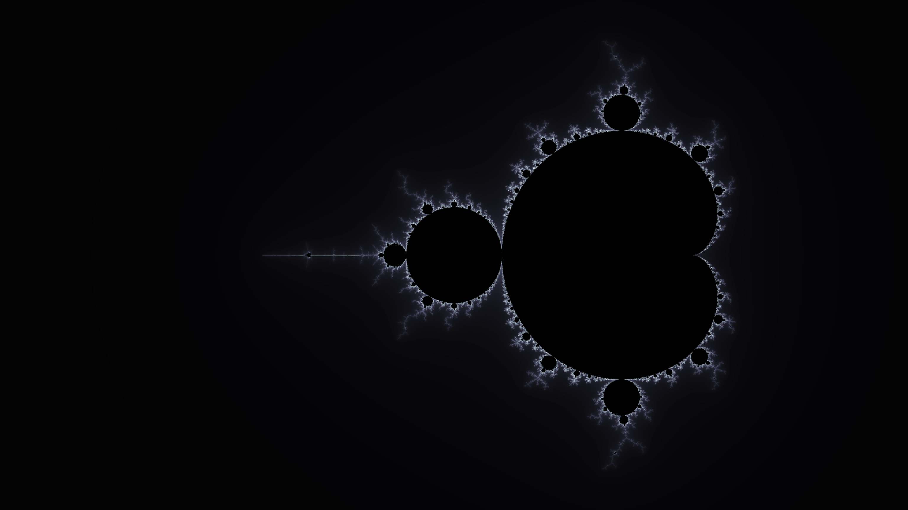

# Mandelbrot Explorer

The Mandelbrot Set is one of the most well known fractals and I wanted to build a program that allows the user to explore this beautiful fractal. This repository contains the source code to build an application that can display single images or generate series of images to put together into animation sequences. The goal was to build an application that can render images quickly by using GPU parallelism. This application supports arbitrary-precision so the max depth is in theory limited by the GPU memory. In practice the arbitrary-precision library starts bugging out at a certain point.

## Getting Started

These instructions will get you a copy of the project up and running on your local machine.

### Prerequisites
- [CUDA 11+](https://developer.nvidia.com/cuda-toolkit)
- CMake 3.19+

### Installing
```
git clone --recursive https://github.com/jackm97/mandelbrot_explorer_CUDA.git
cd ./mandelbrot_explorer
mkdir build
cd build
cmake .. && make
```
This should create an executable in the build directory called `mandelbrot_explorer`.

## Usage
To run the program call:
```
./mandelbrot_explorer arg1
```
`arg1` can take on one of two values: `0` to render a single image and `1` to render many images for an animation sequence and `2` to run the animation sequence and save the images.

### Example 1


```
$ ./mandelbrot_explorer 0

Enter x val: -1

Enter y val: 0

Supersample? (Y/n): y

Which colormap would you like to use (type DEFAULT for monochrome red)?MATLAB_bone

Enter zoom level where zoom = 10^(level): .18

Enter iterations(positive integer): 5000

```
Notice that after the initial program execution, input prompts are displayed in the terminal. These particular inputs generate a supersampled image centered on the complex coordinate (-1,0) with a zoom of ~1.5x. The colormap used is `MATLAB_bone`. The maximum number of iterations before a pixel is considered in the set is 5000.

For more colormap options see [here](https://github.com/kbinani/colormap-shaders).

In this mode you can explore the set using `wasd` to pan, `up/down` to zoom gradually, and `left/right` to zoom by powers of `10`.

Additionally, hitting `Enter` prints information on the current position:
```
Zoom: 14.825
X: -6.993755e-01 4.750392e-09 -1.471667e-16 -3.631952e-24 -1.900695e-31 
Y: 3.491874e-01 -1.001098e-08 -1.847759e-16 3.008357e-24 7.311692e-32  
```
This info can be copied and pasted into the prompts when running the explorer. It's especially useful in finding a good center and final zoom point for the following examples. The format of the x and y positions is how the data is represented by the arbitrary-precision library.

### Example 2


```
$ ./mandelbrot_explorer 1

Enter x val: -1.5231172841989

Enter y val: -4.5676519363104e-18

Supersample? (Y/n): y

Which colormap would you like to use (type DEFAULT for monochrome red)?MATLAB_bone

Enter initial and final zoom level where zoom = 10^(level) (e.g. start_zoom end_zoom): 0 12

Enter number of frames to capture (positive integer): 1900

Enter iterations(positive integer): 5000
```
Like the single image mode, the series image mode has input prompts. In this case the inputs shown above produce 1900 frames that range from a zoom of 1 to a zoom of 1e12. Each frame is supersampled. Once again, the maximum iterations are set to 5000.

### Example 3
```
$ mkdir images
$ ./mandelbrot_explorer 2

Enter x val: -1.5231172841989

Enter y val: -4.5676519363104e-18

Supersample? (Y/n): y

Which colormap would you like to use (type DEFAULT for monochrome red)?MATLAB_bone

Enter initial and final zoom level where zoom = 10^(level) (e.g. start_zoom end_zoom): 0 12

Enter number of frames to capture (positive integer): 1900

Enter iterations(positive integer): 5000

Enter file path to save image series: ./images
```
In this mode the sequence is saved to `./images`. Make sure to create the folder first.
```
ffmpeg -r 60 -start_number 0 -i ../images/image%d.jpg -crf 30 -vcodec libx264 -f mp4 /path/to/animation/animation.mp4
```
The above example generates a 60fps animation. The gif in example 2 is actually generated from this example.

## Limitations/ Future Improvements
- For some reason, the values printed in the first example are not exact. Copying and pasting them into the prompts does not always produce the same result. Because of this some trial and error is required.

## Authors

* **Jack Myers* - *Initial work* - [jackm97](https://github.com/jackm97)

## License

This project is licensed under the MIT License - see the [LICENSE](LICENSE) file for details
